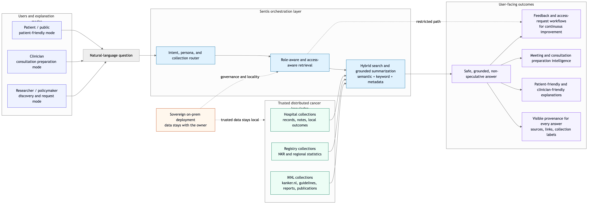
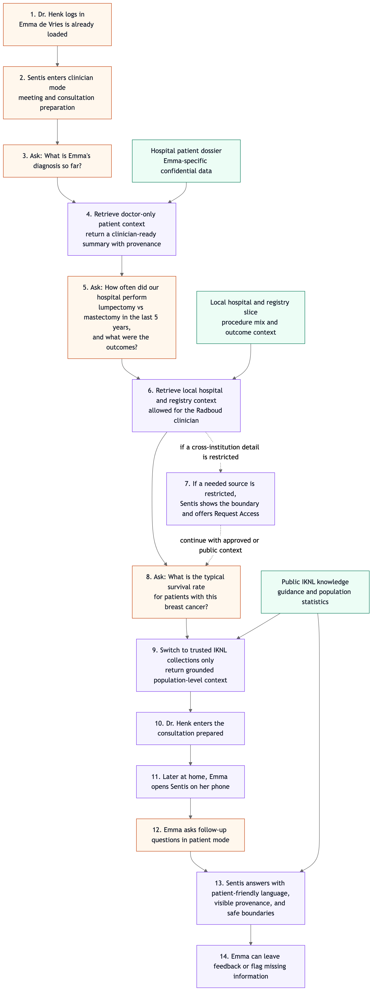

# Sentis

Sentis is a sovereign, on-prem-capable AI knowledge interface over distributed trusted cancer knowledge. It connects IKNL's distributed knowledge landscape and makes it accessible through natural-language questions, so patients, clinicians, researchers, and policymakers can find the right information faster without losing trust, nuance, or source integrity.

Instead of forcing users to search across websites, PDFs, registry dashboards, guidelines, and institutional systems one by one, Sentis retrieves the most relevant evidence from trusted sources and turns it into a grounded, understandable answer. Every answer stays traceable to its underlying sources, so users can verify where the information came from and why it should be trusted.

Sentis is designed around the challenge IKNL actually faces today: trusted information exists, but it is fragmented. People increasingly expect to ask AI directly. Sentis meets that expectation while keeping medical correctness, provenance, safety, and governance front and center.

## Key Product Capabilities

The features we want to make visible in Sentis are:

- sovereign on-prem AI over distributed trusted cancer knowledge
- hybrid search and summarization across hospital, registry, and IKNL collections
- visible provenance for every answer
- role-aware and access-aware retrieval
- safe, grounded, non-speculative answers
- patient-friendly and clinician-friendly explanation modes
- feedback and access-request workflows for continuous improvement

## The Core Value

Sentis improves access to reliable cancer information in three ways.

First, it improves findability. Users can ask questions in plain language instead of guessing which site, report, or guideline contains the answer.

Second, it improves connectedness. Sentis can retrieve across multiple trusted collections and present one coherent answer instead of making the user manually stitch sources together.

Third, it improves comprehension. The system does not just retrieve documents. It explains them in clear language, preserves important nuance, and shows the supporting sources so users can go deeper when needed.

## What Sentis Connects

Sentis is built to work across trusted sources such as:

- `kanker.nl`
- the Netherlands Cancer Registry (`NKR`)
- oncology guidelines
- scientific publications
- IKNL reports
- regional and population-level cancer statistics
- institution-specific knowledge collections when access is permitted

This means the same interface can serve both public and professional use cases while keeping source boundaries explicit.

## Why This Matters

Reliable cancer information is already available, but it is spread across many trusted systems and formats. That fragmentation creates friction for every audience:

- patients and loved ones struggle to find trustworthy answers at emotionally difficult moments
- clinicians lose time switching between systems when they need context quickly
- researchers and policymakers often need to move from public knowledge to more restricted datasets in a controlled way

Sentis turns that fragmented landscape into a single, trustworthy question-and-answer experience without pretending that all information is equal or equally accessible.

## How Sentis Works

At a product level, Sentis combines hybrid search, grounded summarization, explanation-mode switching, and access-aware retrieval in one workflow:

1. A user asks a question in natural language.
2. Sentis identifies the user's context and selects the right explanation mode, such as patient-friendly or clinician-friendly.
3. It selects the relevant trusted collections and access scope for that question.
4. It retrieves supporting evidence using hybrid search across hospital, registry, and IKNL collections.
5. It synthesizes a clear answer grounded in the retrieved evidence only.
6. It shows provenance, safety boundaries, and next actions such as feedback or access request directly in the experience.

The key point is that Sentis is not a generic chatbot. It is a retrieval-first system grounded in validated sources. If the evidence is missing, insufficient, or inappropriate to answer from, Sentis should fail safely, decline, or redirect the user instead of guessing.

## Visual Overview

### System Diagram

[Open full-size system diagram](sentis-system-overview.png)

Mermaid source: `sentis-system-overview.mmd`

### Presentation Deck

A slide version of the project is also included here: [`presentation.pdf`](./presentation.pdf)

## The Demo Prototype

For this demonstration, we created a prototype knowledge base by scraping `5,339` webpages and documents from Richtlijnendatabase and `kanker.nl`, including the PDFs available on those sites. This shows that Sentis can already connect and reason over a large body of trusted cancer information.

To demonstrate secure access beyond public knowledge, we also simulated:

- a patient dossier for Emma de Vries
- internal Radboudumc data
- restricted hospital-specific and registry-style context

This lets us show how Sentis can combine public cancer knowledge with institution-specific information while preserving access boundaries.

## Demo Story: Dr. Henk And Emma de Vries

Dr. Henk is covering for a colleague on short notice. He has only twenty minutes to prepare for a difficult conversation with Emma de Vries about breast cancer treatment.

Inside Sentis, he can ask three simple questions that show the full value of the system.

First, he asks what Emma's diagnosis is so far. Sentis answers using confidential patient information that only he, as the treating doctor, is allowed to access.

Next, he asks how often his hospital performed breast-conserving surgery versus mastectomy over the last five years, and what the outcomes were. Sentis answers from proprietary local data that is not public and not available to every user.

Finally, he asks what the typical survival rate is for patients with this type of breast cancer. Here Sentis grounds the answer in trusted IKNL knowledge. That means the same public-facing answer can also be made available to patients and visitors using the IKNL website or the Sentis app.

Later, when Emma is home, she can open Sentis on her phone and ask the questions she was too overwhelmed to ask during the consultation. She receives understandable answers grounded in trusted IKNL sources, without needing access to confidential hospital information.

That is the heart of Sentis: the right person gets the right knowledge, in the right form, at the right moment.

### Demonstration Flow

[Open full-size demonstration flow](sentis-demo-flow.png)

Mermaid source: `sentis-demo-flow.mmd`

## Audience-Aware By Design

Sentis supports fine-grained access control so different audiences can use the same system safely.

- Patients and the public receive answers grounded in public, trusted knowledge.
- Clinicians can access patient-specific or institution-specific context when they are authorized to do so.
- Researchers and policymakers can discover relevant datasets, statistics, and documentation, and be guided toward the right next step when restricted data requires a formal request.

This makes Sentis more useful than a one-size-fits-all chatbot. It gives each audience a credible path without exposing sensitive information to the wrong person.

## Retrieval-Based Access Control

One of the strongest parts of Sentis is that access is enforced during retrieval, not after generation.

That means Sentis does not first gather everything and then try to hide sensitive information at the end. Instead, it decides up front which collections, documents, and evidence the current user is allowed to retrieve.

In practice, Sentis uses a hybrid access model:

- role-based access determines the user's general lane, such as patient, clinician, researcher, or public visitor
- relationship-aware access determines whether a specific query may retrieve sensitive material because of context such as an active treatment relationship, referral chain, or institution-specific responsibility

This retrieval-based approach matters because it is safer and easier to explain:

- public users retrieve only public collections
- a treating doctor can retrieve relevant patient and hospital context tied to care delivery
- a restricted external record can remain visible as a boundary without revealing its content
- the system can offer an access request or next-step workflow instead of leaking information

In other words, Sentis makes governance visible. Users can see what is accessible, what is restricted, and why.

## Provenance, Integrity, And Safe Failure

Sentis is designed to preserve information integrity rather than flatten it.

- answers are grounded in retrieved evidence from trusted sources
- source provenance is explicit, visible, and inspectable
- the system keeps public guidance, patient-specific data, and institutional data clearly separated
- when the evidence is not strong enough, the system should say so
- when a question would require unauthorized or ethically problematic access, the system should refuse or redirect
- public informational answers should remain supportive and contextual, not unsafe personalized medical advice

This is essential for cancer information. Speed is useful only if trust is preserved.

## The Broader Technical Approach

In broader system terms, Sentis combines several capabilities into one coherent product.

### 1. Ingestion And Curation

Sentis can ingest trusted websites, PDFs, reports, guidelines, registry material, and organization-specific document collections. Sources are curated into clear collections so the system can distinguish, for example, public patient information from professional guidance or institution-specific knowledge.

### 2. Parsing, Normalization, And Indexing

Documents are parsed, normalized, and prepared for retrieval. That includes handling mixed content types such as webpages and PDFs, preserving metadata, and organizing content so it can be searched effectively.

### 3. Hybrid Search Across Collections

When a question is asked, Sentis can combine semantic retrieval, keyword search, and collection-aware filtering across one or more relevant sources instead of forcing the user to know exactly where to look. This is what turns fragmented knowledge into a connected experience.

### 4. Policy-Aware Retrieval

Before information is retrieved, the system checks the user's role, context, and allowed scope. This is where document-level access control and relationship-aware retrieval become critical.

### 5. Grounded Answer Generation

The answer layer does not invent knowledge from scratch. It synthesizes only from the retrieved evidence, which keeps answers closer to the original source material and reduces hallucination risk.

### 6. Explanation Modes And Preparation Intelligence

Sentis can adapt the answer to the audience and the moment. A patient can receive a clearer, supportive explanation grounded in public IKNL knowledge, while a clinician can receive a denser summary optimized for meeting preparation, consultation preparation, and fast decision support.

### 7. Provenance And Feedback

Sentis can surface source links, collection labels, trust indicators, user feedback controls, and access-request workflows so the system not only answers questions, but also helps IKNL learn where information is still unclear, missing, or hard to find.

### 8. Sovereign Deployment

For maximum data sovereignty and privacy, Sentis can run entirely within the infrastructure of the organization that owns the data. Sensitive information does not need to leave the environment in order to become searchable and useful.

## Why AI Adds Real Value Here

The AI value in Sentis is visible even to non-technical users.

It is not just "chat." The AI is useful because it:

- understands natural-language questions
- retrieves relevant evidence across multiple trusted sources
- combines hybrid search with grounded summarization
- summarizes and explains complex information more clearly
- adapts explanation depth for patients and clinicians
- helps clinicians prepare quickly for meetings and consultations
- connects patient-facing and professional-facing pathways in one interface
- helps users move from question to answer in fewer steps
- guides feedback and access-request workflows when needed

This is exactly the kind of modern search behavior users already expect, but applied in a way that keeps trust, provenance, and governance intact.

## Why Sentis Fits IKNL's Success Criteria

Sentis is well aligned with the hackathon brief and success criteria because it:

- solves the real problem of fragmented trusted cancer information
- uses a technically meaningful approach based on multi-source retrieval, source linking, and grounded AI answers
- makes the AI benefit obvious in a short demo
- improves accessibility and connectedness across trusted IKNL sources
- preserves information integrity instead of hiding or rewriting source truth
- makes provenance explicit in the product experience
- fails safely when evidence or authorization is insufficient
- supports multiple audiences through clear pathways
- improves understanding, not just search
- has a credible implementation path beyond a hackathon prototype

Most importantly, it leads with public value today and extends naturally into secure professional and institutional workflows tomorrow.

## Why Sentis Is Different

Many AI demos stop at a nice interface. Sentis goes further.

It combines:

- trusted-source retrieval
- visible provenance
- safe answer behavior
- fine-grained access control
- sovereign deployment options

That combination makes it discussion-worthy for IKNL not just as a hackathon concept, but as a realistic foundation for future implementation.

## Built By Prometheon

Sentis is built by Prometheon.

- Website: `https://prometheon.ai`
- Contact: `mario@prometheon.ai`

If IKNL wants to explore a follow-up, pilot, or deeper implementation path, we would be happy to continue the conversation.
